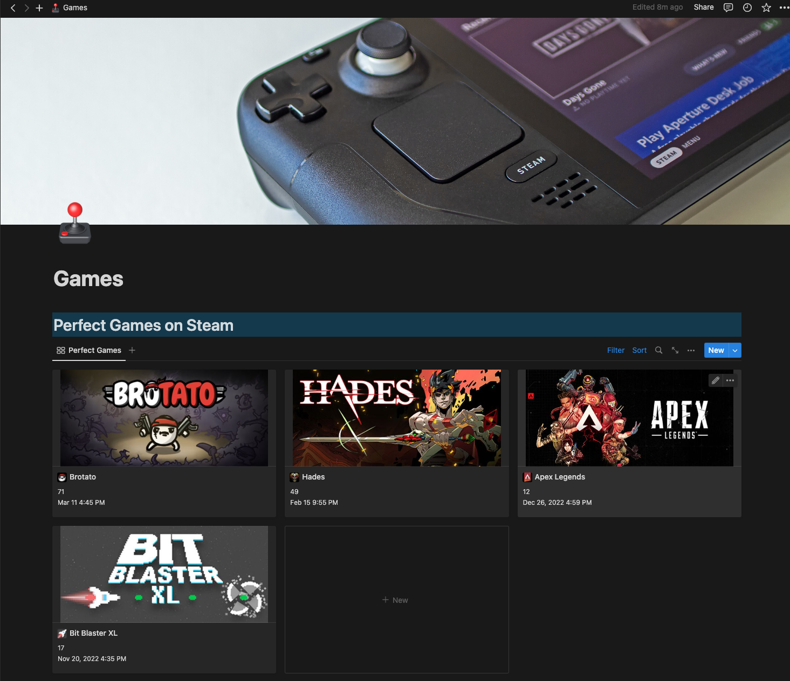
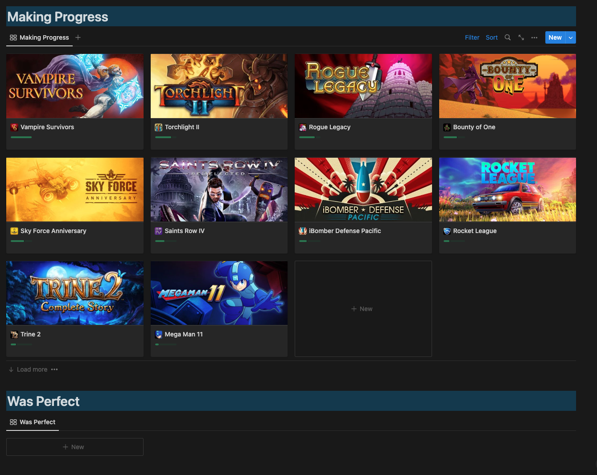

# Perfect Games

This series of scripts and automation is my attempt at keeping track of all the
perfect games that I have achieved on my Steam Deck. Steam does this on your
profile screen, however I noticed that some games actually release more achievements
and it causes you to lose your "perfect game" count when they do that until you
play the game again and complete the new achievements.

Here's what my current profile looks like on steam:

So there's a few things I want to accomplish here:

* Store "perfect game" data in my second brain
* Keep track of which games that were previously perfect have new achievements

I think I can accomplish all of this by entering the information into my second
brain (Notion) and format a database that shows which games have lost their
"perfect game" rating.

# Implementation

Here's an overview of what this repo is for:

* Use Steam Web API to get all games played
* Figure out which games I've played are "perfect games"
* Use Notion API to write games data to a database
* Use Notion API to mark in the database which games are no longer perfect
* Use Github Actions to schedule this as a daily job

# End Result

Now my notion "Games" page looks something like this:

I'm really happy with it because I have an easily accessible view into the games
I am playing on my Steam Deck!

You can read more about how this works from my blog post here: https://blog.wrhansen.dev/posts/2023/automating-my-second-brain/
# References

* https://developer.valvesoftware.com/wiki/Steam_Web_API#GetNewsForApp_.28v0001.29
* https://developers.notion.com/docs/create-a-notion-integration
* https://developers.notion.com/docs/authorization
* https://developers.notion.com/reference/patch-page
* https://developers.notion.com/reference/page-property-values
* https://www.python-engineer.com/posts/run-python-github-actions/
* https://stackoverflow.com/a/54200977/823656
